# 🌊 JAL TARANG (जल तरंग) — Intelligent Maritime Freight Forecasting & Bulk Chartering Optimization

<div align="center">

[](https://www.sih.gov.in/)
[](https://www.sih.gov.in/)
[](https://steel.gov.in/)
[-purple.svg?style=for-the-badge)](#team-cloud-9)
[](https://jal-tarang-git-main-cloud9-1693.vercel.app)
[](#license)

**"From Reactive Spot Fixing to Predictive AI Optimization"**

*An Enterprise Decision Intelligence Platform for Overseas Bulk Raw Material Procurement, Multi-Horizon Freight Forecasting, and Vessel Chartering to the East Coast of India.*

[🌐 Live Showcase Demo](https://jal-tarang-git-main-cloud9-1693.vercel.app) • [📑 Problem Statement](#problem-statement-context) • [🏛️ Architecture & AI Pipeline](#technical-approach--ai-pipeline) • [🚀 8 Core Modules](#prototype-capabilities--the-8-core-modules) • [📈 Business ROI](#projected-impact--measurable-outcomes) • [🛠️ Setup Guide](#quickstart--developer-guide)

</div>

---

## 📌 Problem Statement Context

* **Problem Statement ID:** `SIH26006`
* **Title:** *The development of an intelligent freight forecasting model for optimized Vessel Chartering and Bulk Cargo Procurement from overseas to east coast of India*
* **Theme:** Transportation and Logistics
* **Category:** Software
* **Nodal Organization:** Ministry of Steel / Steel Authority of India Limited (SAIL)
* **Team Name:** Cloud 9 (`Cloud9_SUAS26`)

### The Industrial Challenge
Steel Authority of India Limited (SAIL) and major Indian steel producers import over **15 to 20 million metric tonnes** of premium metallurgical coking coal, PCI coal, and limestone annually from overseas sources (primarily Queensland / Hay Point / DBCT, Australia, Indonesia, and North America) into India's East Coast gateway ports (**Paradip, Visakhapatnam, Haldia, and Dhamra**). This incurs an annual ocean freight spend exceeding **₹5,000 to ₹6,000 Crores**.

Historically, chartering and procurement desks operate under severe operational handicaps:
1. **Reactive Spot Fixing:** Sourcing vessels under tight supply windows without forward rate trajectory visibility, resulting in premium freight payments.
2. **Extreme Freight Volatility:** Capesize C5TC and Panamax routes fluctuate by 30–60% within weeks based on bunker prices, seasonal grain movements, and commodity cycles.
3. **Data Fragmentation:** Critical intelligence—Baltic Exchange indices, vessel AIS positions, IMD weather warnings, port draft restrictions, and plant stockpile levels—is scattered across disconnected spreadsheets and telex feeds.
4. **East Coast Port Bottlenecks & Demurrage:** Riverine draft limitations at Haldia, sandheads lighterage delays, and Bay of Bengal cyclone seasons trigger massive demurrage penalties ($15,000 to $25,000/day per vessel).

---

## 💡 The Jal-Tarang Solution: Predict → Optimize → Decide (ACT)

**JAL TARANG (जल तरंग)** transforms Indian maritime bulk logistics from reactive guesswork into an automated, mathematically grounded **Predictive Decision Pipeline**:

```
 ┌──────────────────────┐      ┌─────────────────────────┐      ┌─────────────────────────┐
 │   1. PREDICT         │      │   2. OPTIMIZE           │      │   3. DECIDE (ACT)       │
 │                      │      │                         │      │                         │
 │ • Baltic Indices     │      │ • OR-Tools LP/MIP       │      │ • Final Fixture Order   │
 │ • LSTM + Prophet +   │ ───► │   COA vs. Spot Split    │ ───► │ • Transchart Requisition│
 │   XGBoost Ensemble   │      │ • Vessel Draft & LOA    │      │ • Demurrage Avoidance   │
 │ • 7/30/90-Day Curves │      │ • Port Sandheads Route  │      │ • Landed Cost Minimized │
 └──────────────────────┘      └─────────────────────────┘      └─────────────────────────┘
```

### The Core Decision Flow
$$\text{Current Freight Rate} \longrightarrow \text{7/30/90-Day Forecast} \longrightarrow \text{Market Risk \& Confidence} \longrightarrow \text{COA / Spot Optimization} \longrightarrow \text{Vessel + Port Match} \longrightarrow \text{Minimized Landed Cost}$$

---

## 🚀 Prototype Capabilities — The 8 Core Modules

Grounded in our official SIH2026 submission blueprint, Jal-Tarang features 8 production-grade operational modules:

| # | Module | Technical Description & Implementation |
|---|---|---|
| **1** | **Multi-Horizon Freight Forecasting** | **7, 30, and 90-day forward predictions** with shaded 95% Confidence Interval (CI) bands. Powered by a hybrid ensemble (LSTM 40% + Prophet 30% + XGBoost 30%) with automated walk-forward backtesting against Naïve and ARIMA baselines. |
| **2** | **Charter Timing Advisor** | Intelligent market momentum indicator (**"Wait" vs. "Book Now"**). Evaluates forward slope, bunker price velocity, and fleet tonnage supply to prevent premature market fixing in a falling freight market. |
| **3** | **Vessel & Port Physical Optimizer** | Automated compatibility matrix checking **Beam, Length Overall (LOA), Deadweight Tonnage (DWT)**, and **maximum arrival draft** against dynamic port constraints across Paradip, Vizag, Haldia, and Dhamra. |
| **4** | **COA vs. Spot Optimizer (LP / MIP)** | Linear & Mixed-Integer Programming engine (using Google OR-Tools / PuLP) determining the optimal contract split (e.g. 70% COA hedge vs. 30% opportunistic Spot) to minimize landed procurement cost under supply risk. |
| **5** | **Cyclone & Congestion Early Warning** | Live integration of **IMD Bay of Bengal cyclone tracks**, port waiting days telemetry, wave height thresholds, and alert levels (Signals 1–11) to mitigate demurrage exposure. |
| **6** | **Transchart-Format Cargo Requisition** | 1-click automated compilation of chartering requirements into standardized **Ministry of Shipping (Transchart) & SAIL tender dossiers**, complete with laycan windows, NOR terms, and demurrage rates. |
| **7** | **Explainable AI (SHAP-Style Attribution)** | Transparent algorithmic attribution breaking down freight forecasts into measurable drivers: *Bunker price impact (+32%), Port waiting delays (+28%), Iron ore demand (+22%), Seasonal monsoon index (-12%)*. |
| **8** | **Scenario & What-If Simulation Studio** | Interactive simulation engine for stress-testing supply chain shocks: **Bunker fuel spikes (+25%)**, **Suez / Malacca detour delays**, and **East Coast port closures** with landed cost sensitivity curves. |

---

## 🏛️ Technical Approach & AI Pipeline

```mermaid
graph TD
    subgraph DataLayer ["1. DATA INGESTION & SENSORS"]
        BALTIC["Baltic Exchange (BDI, BCI, BPI, C5TC)"]
        BUNKER["Global Bunker Index (VLSFO / MGO)"]
        AIS["Satellite AIS Telemetry Stream"]
        IMD["IMD Cyclone & Weather Feeds"]
        SAIL_DATA["SAIL Plant Stockpiles & Tender CSVs"]
    end

    subgraph StorageLayer ["2. ENTERPRISE STORAGE & CACHE"]
        PG["PostgreSQL 16 + PostGIS (Spatial Corridors)"]
        REDIS["Redis In-Memory State Cache"]
        FALLBACK["Offline In-Memory Resilient Dataset"]
    end

    subgraph MLPipeline ["3. AI / ML ENSEMBLE ENGINE"]
        LSTM["PyTorch LSTM (40% Weight)<br/>Deep Temporal Dependencies"]
        PROPHET["Facebook Prophet (30% Weight)<br/>Maritime Seasonality & Holidays"]
        XGB["XGBoost / LightGBM (30% Weight)<br/>Exogenous Commodity Factors"]
        ENSEMBLE["Hybrid Forecast Combiner<br/>7 / 30 / 90-Day Predictions + 95% CI"]
    end

    subgraph OptimizationLayer ["4. MATHEMATICAL OPTIMIZATION"]
        OR_TOOLS["Google OR-Tools & PuLP<br/>LP / MIP COA vs Spot Optimizer"]
        MONTE_CARLO["Merton Jump-Diffusion<br/>10,000-Path Monte Carlo Simulation"]
        MARKOWITZ["Markowitz Efficient Frontier<br/>Risk-Adjusted Portfolio Variance"]
    end

    subgraph PresentationLayer ["5. CLIENT & DECISION SUPPORT"]
        VITE["Vite + React 19 + TypeScript SPA"]
        RADAR["Leaflet Interactive Maritime GIS Radar"]
        COPILOT["Maritime Decision Copilot (LLM + Domain Tools)"]
        TRANSCHART["Transchart Dossier & PDF Verification Engine"]
    end

    DataLayer --> StorageLayer
    StorageLayer --> MLPipeline
    MLPipeline --> OptimizationLayer
    OptimizationLayer --> PresentationLayer
```



### Technology Matrix

| Layer | Technologies | Engineering Purpose |
| :--- | :--- | :--- |
| **Frontend SPA** | React 19, TypeScript, Vite 5, Tailwind CSS, Lucide React, Recharts | Glassmorphic, 60 FPS responsive UI, light/dark themes, INR/USD currency toggle, accessible WCAG 2.1 compliance. |
| **GIS & Radar** | Leaflet, OpenStreetMap, GeoJSON, Turf.js | Real-time vessel coordinates, shipping lanes, port congestion radius, cyclone isobar tracks. |
| **API Gateway** | Node.js 22 LTS, Express 5, Decimal.js, Vercel Serverless Edge | Microsecond routing, 20-digit arbitrary financial precision for freight billing, full CORS, RESTful OpenAPI spec. |
| **AI / ML Stack** | Python 3.11, PyTorch, Prophet, XGBoost, Scikit-learn, NumPy | Ensemble econometric modeling, seasonal wave decomposition, SHAP feature importance explainability. |
| **Optimization** | Google OR-Tools, PuLP, SciPy Optimization | Simplex / Interior-point Mixed-Integer Linear Programming (MILP) for vessel-to-berth and COA allocation. |
| **Database** | PostgreSQL 16 with PostGIS, Redis 7 | Spatial geodesic distance queries, ACID-compliant ledger, sub-millisecond session caching. |
| **Security** | JWT, OAuth 2.0, RBAC, Helmet, Express-Rate-Limit, AES-256 | Multi-role clearance, brute-force mitigation, encrypted commercial fixture records. |

---

## 🧮 Mathematical Formulations & Maritime Equations

Jal-Tarang is mathematically rigorous, implementing proven formulations from maritime econometrics and naval architecture:

### 1. Merton Jump Diffusion Stochastic Freight Rate Model (Module 1 & 8)
Freight spot prices $S_t$ exhibit continuous volatility compounded by geopolitical and weather shocks:
$$\frac{dS_t}{S_t} = (\mu - \lambda k) dt + \sigma dW_t + J_t dN_t$$
* $\mu$: Annualized freight momentum drift
* $\sigma$: Baltic historical volatility parameter
* $W_t$: Standard Brownian motion (Wiener process)
* $N_t$: Poisson process with jump arrival rate $\lambda$
* $J_t$: Lognormal jump amplitude: $\ln(1 + J_t) \sim \mathcal{N}(\mu_J, \sigma_J^2)$
* $k$: Jump compensator: $\mathbb{E}[J_t] = \exp(\mu_J + \frac{1}{2}\sigma_J^2) - 1$

### 2. Markowitz & MIP COA vs. Spot Portfolio Optimization (Module 4)
Minimizes total landed freight cost and price variance subject to statutory steel plant procurement minimums:
$$\min_{\mathbf{w}} \left( \frac{1}{2} \mathbf{w}^T \mathbf{\Sigma} \mathbf{w} - \gamma \mathbf{w}^T \boldsymbol{\mu} \right)$$
$$\text{subject to } w_{\text{COA}} + w_{\text{Spot}} = 1, \quad w_{\text{COA}} \ge 0.60, \quad w_{\text{Spot}} \ge 0$$
* $\mathbf{\Sigma}$: Freight rate variance-covariance matrix across routes
* $\gamma$: Risk-aversion coefficient configured by SAIL management
* Constrained by plant minimum 15-day blast furnace safety inventory buffers.

### 3. Hooghly River Dynamic Tidal Draft & Astrological Tide Window (Module 3 & 5)
Calculates navigable water depth $h(t)$ above chart datum for Haldia Dock Complex:
$$h(t) = Z_0 + \sum_{i=1}^{37} f_i A_i \cos\left(\omega_i t + (V_0 + u)_i - \kappa_i\right)$$
Compounded with **Barrass Dynamic Ship Squat** in shallow confined channels:
$$\Delta h_{\text{squat}} = \frac{C_b \cdot V_k^{2.08}}{30} \cdot \left(\frac{A_S}{A_C}\right)^{0.81} \quad \text{[meters]}$$
* Prevents riverbed groundings across the Auckland and Balari bars by timing departures to the exact astronomical high-tide peak.

### 4. Statement of Facts (SOF) Laytime & Demurrage Liability (Module 5 & 6)
$$\text{Allowed Laytime} = \frac{\text{Cargo Bill of Lading (MT)}}{\text{Agreed Daily Discharge Rate (MT/WWDSHEX)}}$$
$$\text{Demurrage Liability} = \max\left(0, \frac{T_{\text{Countable}} - T_{\text{Allowed}}}{24}\right) \times \text{Daily Demurrage Rate (USD)}$$
$$\text{Despatch Earned} = \max\left(0, \frac{T_{\text{Allowed}} - T_{\text{Countable}}}{24}\right) \times \left(0.5 \times \text{Daily Demurrage Rate}\right)$$

---

## 📈 Projected Impact & Measurable Outcomes

| Metric / KPI | Historical Reactive Baseline | Jal-Tarang Target / Outcome | National & Industrial Impact |
| :--- | :--- | :--- | :--- |
| **Ocean Freight Cost** | Volatile spot exposure | **8% to 15% Reduction** | Projected **₹500 to ₹800 Cr/year savings** on SAIL's ₹5,000–6,000 Cr freight spend. |
| **7-Day Forecast Accuracy** | Subjective gut feel / Moving avg | **< 8.0% MAPE** | Precision timing for spot cargo fixture tenders. |
| **30-Day Forecast Accuracy** | 20–35% variance | **< 12.0% MAPE** | Informed monthly COA volume commitment planning. |
| **Cyclone Demurrage Risk** | High demurrage exposure | **20% to 30% Reduction** | Re-routing vessels to Paradip/Dhamra prior to Bay of Bengal cyclonic landfall. |
| **Procurement Cycle Time** | 3–5 days manual telex analysis | **60% to 70% Faster** | Automated Transchart-compliant requisition dossiers generated in under 60 seconds. |
| **Plant Stockout Incidents** | Critical buffer drops | **0 Stockouts** | Multi-echelon stock alarms linked to blast furnace daily consumption rates. |

---

## 👥 Role-Based Access Control (RBAC)

Jal-Tarang enforces 6 official enterprise operational personas:

| Operational Persona | Designated Officer | Primary Clearance & Capabilities |
| :--- | :--- | :--- |
| **Chartering Manager** | Capt. Rajesh Sharma | Commercial fixture execution, Baltic index tracking, laytime & demurrage desk, Transchart export. |
| **Chief Operating Officer (COO)** | Dr. Amitabh Roy | Executive logistics oversight, fleet utilization metrics, macro procurement approvals. |
| **Executive Director (Logistics)** | Smt. Sunita Verma | High-level cost variance reporting, statutory policy enforcement, Ministry review briefings. |
| **Port Logistics Officer** | Shri Vikramaditya Seth | Berth allocation, tidal bar crossing windows, crane outreach checks, rake dispatch coordination. |
| **Strategic Market Analyst** | Ananya Mukherjee | Econometric model tuning, SHAP explainability analysis, Monte Carlo simulation studio. |
| **System Administrator** | IT Security & Governance | Audit trail ledger inspection, API gateway controls, role provisioning, system health telemetry. |

---

## 🧭 Page Showcase & Evaluator Walkthrough

For evaluating the prototype in under 3 minutes, follow this direct operational sequence:

```
1. Login Portal (/login)
   └── Instant 1-Click Role Switcher (Pre-configured official demo personas)
        ▼
2. Maritime Control Tower (/control-tower)
   └── Interactive GIS Radar Map with live Bay of Bengal vessel telemetry & port status
        ▼
3. Freight Forecasting Dashboard (/forecasting)
   └── 7/30/90-Day Ensemble Forecast Curves, Confidence Bands & "Wait vs Book" Indicator
        ▼
4. Decision Intelligence Center (/decision/all)
   └── OR-Tools COA vs Spot Optimizer, Vessel Draft Feasibility & 1-Click Transchart Export
        ▼
5. Port Intelligence & Cyclone Radar (/ports)
   └── Real-time East Coast congestion tracking, Tidal Bar crossing & Demurrage sensitivity
```

---

## 🛠️ Quickstart & Developer Guide

### Prerequisites
* **Node.js**: v20 LTS or v22 LTS
* **pnpm**: v9+ / v12+ (`npm install -g pnpm`)
* **Python**: v3.11+ *(optional, for standalone ML training)*

### 1. Clone & Install Dependencies

```bash
# Clone the repository
git clone https://github.com/AXAradhya/Jal-Tarang.git
cd Jal-Tarang

# Install Root Backend Dependencies
pnpm install

# Install Frontend Dependencies
cd frontend
npm install
cd ..
```

### 2. Run the Platform Locally

```bash
# Terminal 1: Start Backend API (Express on port 8000)
npm run dev

# Terminal 2: Start Frontend Application (Vite on port 3000 / 5173)
cd frontend
npm run dev
```

Open your browser at **`http://localhost:3000`** (or `http://localhost:5173`). Click any persona card on the login screen to enter the platform instantly.

### 3. Automated Validation & Quality Gates

```bash
# 1. Frontend Strict TypeScript Type Check (0 Errors)
npm --prefix frontend run build

# 2. Backend TypeScript Compilation
npm run type-check

# 3. Unit & Mathematical Engine Test Suite
npm test
```

---

## 📂 Project Directory Structure

```
Jal-Tarang/
├── api/                       # Vercel Serverless Function Edge Gateway
│   └── index.js               # Cloud Edge API Handler (CORS, Auth, Datasets, Health Probes)
├── backend/                   # Python Core Configuration
├── data/                      # AIS Vessel Telemetry, Port Datasets & Baltic Historical Benchmarks
├── frontend/                  # React 19 + TypeScript + Vite Single-Page Application
│   ├── src/
│   │   ├── api/               # Axios API client, query keys & service contracts
│   │   ├── components/        # Reusable UI widgets (Radar Map, Tidal Bar, Charts, Modals)
│   │   ├── hooks/             # Custom hooks (useLiveStatus, useAuth, useDebounce)
│   │   ├── lib/               # Mathematical utilities, currency formatting & CSV engines
│   │   ├── pages/             # Core Operational Pages
│   │   │   ├── auth/          # LoginPage with Enterprise Showcase fallback
│   │   │   ├── dashboard/     # ControlTower, Executive, Chartering & Port Dashboards
│   │   │   ├── decision/      # DecisionCenterPage (LP/MIP Optimizer & Transchart Export)
│   │   │   ├── forecasting/   # ForecastDashboardPage (LSTM/Prophet/XGB Ensemble Curves)
│   │   │   ├── ports/         # PortIntelligencePage (Tidal Bar & Cyclone Alerts)
│   │   │   ├── cargo/         # CargoRequirementWizardPage
│   │   │   └── scenarios/     # ScenarioCenterPage (What-If Simulation Studio)
│   │   └── store/             # Zustand state stores (authStore, uiStore, settingsStore)
│   ├── package.json
│   └── vite.config.ts
├── ml-service/                # Python ML Microservice (FastAPI + Uvicorn + PyTorch)
├── prisma/                    # PostgreSQL Prisma Schema & Migrations
├── src/                       # Node.js Express 5 Enterprise Orchestrator
│   ├── config/                # Environment variables & constants
│   ├── db/                    # PostgreSQL connection pool & resilient fallback engine
│   ├── routes/                # 30+ Express REST route handlers
│   ├── services/              # Domain services (Optimization, Ingestion, Decision, Feasibility)
│   └── index.ts               # Express application entrypoint
├── pnpm-lock.yaml             # Tracked dependency lockfile
├── vercel.json                # Vercel build & route rewrite configuration
└── README.md                  # Master Documentation
```

---

## 👥 Team Cloud 9

| Member Name | Role / Specialization | Contact / Links |
| :--- | :--- | :--- |
| **Aradhya Saxena** | Full Stack Architecture, Cloud Infrastructure & Systems Engineering | [GitHub](https://github.com/AXAradhya) |
| **Team Cloud 9** | Machine Learning, Mathematical Modeling & UI/UX Design | Smart India Hackathon 2026 |

*Research Guidance and Maritime Operations Discussion: Capt. Arpit Choubey (Indian Navy).*

---

## 📄 License & Intellectual Property

This software prototype is developed for the **Smart India Hackathon 2026** under Problem Statement **SIH26006**. All rights and intellectual property align with Ministry of Steel, Government of India, and Team Cloud 9 guidelines.

<div align="center">
<b>🌊 JAL TARANG — Navigating India's Maritime Logistics with Algorithmic Precision.</b>
</div>
