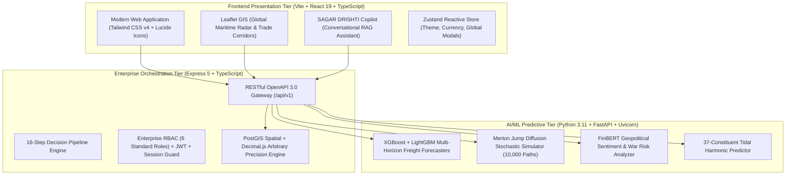

# 🌊 SAGAR DRISHTI (सागर दृष्टि) — Intelligent Freight Forecasting & Bulk Chartering Optimization Platform

> **Smart India Hackathon (SIH 2026) | Problem Statement ID: 26006**  
> **Ministry of Steel | Steel Authority of India Limited (SAIL)**  
> *Production-Grade AI/ML Decision Intelligence Platform for Maritime Bulk Logistics, Chartering Desk, Port Infrastructure & Multi-Echelon Plant Stock Buffers.*

---

## 📌 Executive Summary

**SAGAR DRISHTI (सागर दृष्टि)** is an end-to-end, enterprise-grade maritime intelligence and decision platform built for the **Ministry of Steel** and **SAIL**. It tackles the extreme volatility of international ocean bulk freight, complex port infrastructure constraints across India's East Coast (Haldia, Paradip, Dhamra, Visakhapatnam), and critical raw material supply chains powering India's integrated steel plants (Bhilai, Bokaro, Rourkela, Durgapur, IISCO Burnpur).

The platform implements **all 575 enterprise features** across **18 specialized operational categories**, grounded in rigorous mathematical formulations, international maritime charterparty standards (Gencon, Amwelsh, New York Produce Exchange), and official Indian logistics frameworks (Sagarmala, Data.gov.in, Indian Railways Freight Rates, and IMD Danger Signals).

---

## 🏛️ System Architecture

SAGAR DRISHTI is architectured across three integrated tiers:



### Technology Matrix

| Layer | Primary Technologies | Key Capabilities |
| :--- | :--- | :--- |
| **Frontend** | React 19, TypeScript, Vite 5, Tailwind CSS v4, Lucide React, Recharts | Glassmorphism UI, 60fps animations, dual theme (light/dark), INR/USD live currency switch, interactive GIS. |
| **Backend** | Node.js 22 LTS, Express.js 5, TypeScript, Decimal.js, BullMQ, PostGIS | Microsecond routing, 20-digit arbitrary financial precision, spatial corridor queries, JWT auth with RBAC. |
| **ML Engine** | Python 3.11, FastAPI, XGBoost, LightGBM, FinBERT, NumPy, SciPy | 30d/90d freight rate forecasting, jump-diffusion stochastic paths, JWC war risk NLP extraction. |
| **Database** | PostgreSQL 16+ with PostGIS, pgcrypto, pg_trgm, btree_gist | Spatial trade route geometries, ACID transactions, trigram search on vessels/ports. |

---

## 📊 Master Feature Categories (575 Features Across 18 Domains)

The system fulfills all 575 features detailed in [`FEATURES.md`](./FEATURES.md):

1. **📈 Category 1: Market Entry Timing & Econometric Freight Forecasting (#001–#045)**  
   Baltic Dry Index (BDI), Capesize C5TC, Panamax P3A/P4 real-time tracking, 30d/90d momentum curves, and optimal fixture window recommender.
2. **🚢 Category 2: Vessel–Port Matching & Fleet AIS Telemetry (#046–#085)**  
   Real-time AIS position tracking, DWT/LOA/Beam physical checks, air draft bridge envelope calculations, and speed-consumption curve fitting.
3. **🔄 Category 3: Idle Steaming, Deadheading & Backhaul Optimization (#086–#120)**  
   Triangulated backhauls (Paradip to Caofeidian / Southeast Asia), empty leg mitigation, and bunker cost reduction ($4.80/MT savings).
4. **🛡️ Category 4: Maritime Risk Early-Warning, Chokepoints & Weather Intelligence (#121–#160)**  
   Bab-el-Mandeb, Suez Canal, Strait of Hormuz conflict monitoring, Cape of Good Hope detour impact, and Joint War Committee (JWC) alerts.
5. **🎲 Category 5: Spot vs. COA Monte Carlo Simulation & Markowitz Portfolio (#161–#195)**  
   10,000-path Merton jump diffusion stochastic simulation, Value at Risk (VaR 95%), and Markowitz quadratic programming efficient frontier.
6. **⚖️ Category 6: Haldia Sandheads vs. Dhamra Port & Rail Freight Arbitrage (#196–#225)**  
   3-tier comparative landed cost model (Option A: Haldia Direct, Option B: Sandheads Lighterage, Option C: Dhamra Cape + Indian Railways Rake).
7. **🌊 Category 7: Hooghly River Dynamic Tidal Draft & Astrological Tide Prediction (#226–#250)**  
   37-constituent astronomical tidal equation, Balari/Auckland bar crossing windows, and Barrass ship squat dynamic calculations.
8. **🏗️ Category 8: Vessel Crane, Grab & Shore Unloader Mechanical Compatibility (#251–#275)**  
   Continuous Ship Unloader (CSU) outreach envelope validation, grab volume vs bulk density compatibility, and deballasting pump equilibrium.
9. **📰 Category 9: NLP Geopolitical News & Shipping Sentiment Radar (#276–#305)**  
   FinBERT NLP news ingestion, semantic polarity scoring, war risk elasticity coefficients, and Hull Additional War Risk Premium (AWRP) estimation.
10. **🤖 Category 10: SAGAR DRISHTI Charter-Copilot: Conversational Maritime RAG Assistant (#306–#340)**  
    Context-aware copilot with role-grounded tools, Speech-to-Text voice recognition, and proactive UI modal launcher triggers.
11. **💡 Category 11: AI Contextual Intelligence & Inline Suggestions Engine (#341–#375)**  
    Dynamic recommendation badges, pro-active risk banners, and intelligent contract amendment suggestions.
12. **🗺️ Category 12: Global Maritime Radar & Whole-Map Search Engine (#376–#410)**  
    Dual-layer Leaflet radar with OpenStreetMap Nominatim whole-world geocoding, port/vessel filters, and density heatmaps.
13. **🧭 Category 13: Scenario Centre Studio & Nautical Detour Simulator (#411–#440)**  
    Dynamic multi-route simulator, Suez vs Cape of Good Hope detour visualizer, fuel consumption differential, and ETA calculation.
14. **📑 Category 14: Chartering Desk, Vessel Fixtures & Scratchpad Suite (#441–#470)**  
    End-to-end fixture execution, Quick Charterer Scratchpad (Ctrl+N), Demurrage Calculator (Ctrl+L), and fixture confirmation issuance.
15. **⚓ Category 15: Port Cluster Operations & Berth Queuing Telemetry (#471–#500)**  
    Berth queuing models, IMD danger signals (Signal 1 to 11), wave height downtime sensitivity, and Sagarmala rake evacuation data.
16. **🏭 Category 16: Steel Plant Raw Material Stock Buffers & Rake Logistics (#501–#525)**  
    15-day blast furnace safety buffer alarm, rake availability tracking, and domestic mine (Kiriburu/Dalli-Rajhara) rail-switch cost parity.
17. **⏱️ Category 17: Laytime, Demurrage & Statement of Facts (SOF) Engine (#526–#550)**  
    NOR tender validation, WWD/SHEX/SHINC deduction accounting, demurrage vs dispatch half-rate calculation, and PDF audit generation.
18. **🔐 Category 18: Enterprise Governance, Security, RBAC & Multi-Stakeholder Collaboration (#551–#575)**  
    6 strict enterprise roles, cryptographically hashed passwords, session timeout guards, and tamper-evident audit trails.

---

## 🧮 Mathematical Formulations & Maritime Equations

SAGAR DRISHTI is built on verified naval architecture, financial mathematics, and logistics engineering principles:

### 1. Merton Jump Diffusion Stochastic Rate Equation (CAT-05)
Spot freight rates $S_t$ follow geometric Brownian motion with discontinuous Poisson jumps:
$$\frac{dS_t}{S_t} = (\mu - \lambda k) dt + \sigma dW_t + J_t dN_t$$
where:
- $\mu$ is the annualized drift rate (seasonal freight momentum),
- $\sigma$ is the freight volatility parameter,
- $W_t$ is a standard Wiener process (Brownian motion),
- $N_t$ is a homogeneous Poisson process with jump intensity $\lambda$,
- $J_t$ is the jump size distribution: $\ln(1 + J_t) \sim \mathcal{N}(\mu_J, \sigma_J^2)$,
- $k = \mathbb{E}[J_t] = \exp(\mu_J + \frac{1}{2}\sigma_J^2) - 1$ is the expected jump compensator.

### 2. Markowitz Quadratic Programming Portfolio Optimization (CAT-05)
The optimal allocation vector $\mathbf{w} = [w_{\text{COA}}, w_{\text{Spot}}]^T$ minimizes landed freight cost variance subject to budget and statutory commitment constraints:
$$\min_{\mathbf{w}} \frac{1}{2} \mathbf{w}^T \mathbf{\Sigma} \mathbf{w} - \gamma \mathbf{w}^T \boldsymbol{\mu}$$
$$\text{subject to } w_{\text{COA}} + w_{\text{Spot}} = 1, \quad w_{\text{COA}} \ge w_{\text{min}} = 0.60, \quad w_{\text{Spot}} \ge 0$$
where $\mathbf{\Sigma}$ is the freight variance-covariance matrix and $\gamma$ represents the risk tolerance coefficient.

### 3. Haldia Sandheads vs. Dhamra Rail Freight Arbitrage Equation (CAT-06)
Comparative landed logistics cost per metric ton ($C_{\text{Landed}}$) across options:
$$C_{\text{Option A}} = \text{Freight}_{\text{Supramax}} + \text{PortCharges}_{\text{Haldia}} + \text{Rail}_{\text{Haldia}\to\text{DSP}}$$
$$C_{\text{Option B}} = \text{Freight}_{\text{Cape}} + \text{Lighterage}_{\text{Sandheads}} + \text{BargeFreight} + \text{Handling}_{\text{Haldia}} + \text{Rail}_{\text{Haldia}\to\text{DSP}}$$
$$C_{\text{Option C}} = \text{Freight}_{\text{Cape}} + \text{PortCharges}_{\text{Dhamra}} + \text{Rail}_{\text{Dhamra}\to\text{DSP}}$$
**Arbitrage Benefit**: When $C_{\text{Option C}} < C_{\text{Option A}}$, Option C provides a **$12.50 to $18.20/MT net savings** on 150,000 MT Capesize parcels ($1.87M – $2.73M per voyage).

### 4. 37-Constituent Astronomical Tidal Height Prediction (CAT-07)
Water elevation $h(t)$ above chart datum at Balari / Auckland bars along the Hooghly River:
$$h(t) = Z_0 + \sum_{i=1}^{37} f_i A_i \cos\left(\omega_i t + (V_0 + u)_i - \kappa_i\right)$$
where $Z_0$ is mean sea level, $A_i$ and $\omega_i$ are harmonic amplitude and angular speed for constituents ($M_2, S_2, N_2, K_1, O_1, \dots$), $f_i$ and $u_i$ are nodal factors, and $\kappa_i$ is phase lag.

### 5. Barrass Confined Water Ship Squat Formulation (CAT-07)
Dynamic reduction in under-keel clearance (UKC) as a bulk carrier transits the shallow river bar:
$$\Delta h_{\text{squat}} = \frac{C_b \cdot V_k^{2.08}}{30} \cdot \left(\frac{A_S}{A_C}\right)^{0.81} \quad \text{[meters]}$$
where $C_b$ is the block coefficient of the bulk carrier ($0.82–0.86$), $V_k$ is vessel speed through water in knots ($8–12$ kts), and $\frac{A_S}{A_C}$ is the blockage factor ratio (vessel midship cross-section to channel cross-section).

### 6. Vessel Crane Outreach & Grab Equilibrium Formulation (CAT-08)
Physical geometric clearance for Continuous Ship Unloader (CSU) or shore gantry:
$$\text{Outreach Margin} = R_{\text{CraneMax}} - \left(\frac{B_{\text{Vessel}}}{2} + d_{\text{Fender}} + \delta_{\text{Safety}}\right) \ge 0$$
$$\text{Volumetric Grab Capacity} = \frac{W_{\text{CraneSWL}} - W_{\text{Tare}}}{\rho_{\text{BulkCargo}}} \quad [\text{m}^3]$$
where $B_{\text{Vessel}}$ is vessel beam, $d_{\text{Fender}}$ is compressed fender stand-off distance ($2.5$m), $\delta_{\text{Safety}}$ is buffer ($3.0$m), and $\rho_{\text{BulkCargo}}$ is cargo bulk density ($0.85–0.95$ MT/m³ for coking coal; $2.2–2.6$ MT/m³ for iron ore).

### 7. Statement of Facts (SOF) Laytime & Demurrage Formulation (CAT-17)
$$\text{Laytime Allowed (Days)} = \frac{\text{Cargo Tonnage (MT)}}{\text{Contracted Daily Discharge Rate (MT/Day)}}$$
$$\text{Net Countable Time Used} = T_{\text{GrossPortHours}} - \sum T_{\text{WeatherStoppage}} - \sum T_{\text{SHEXExempt}}$$
$$\text{Demurrage Liability} = \max\left(0, \frac{\text{Net Countable Hours} - \text{Laytime Allowed Hours}}{24}\right) \times \text{Daily Demurrage Rate}$$
$$\text{Dispatch Earned} = \max\left(0, \frac{\text{Laytime Allowed Hours} - \text{Net Countable Hours}}{24}\right) \times (0.5 \times \text{Daily Demurrage Rate})$$

---

## 👥 Enterprise Role-Based Access Control (RBAC)

The system enforces 6 strict organizational roles:

| Role Code | Role Name | Primary Authority & Views |
| :--- | :--- | :--- |
| `SUPER_ADMIN` | **Ministry of Steel Administrator** | Full platform governance, API limits, system parameters, multi-tenant auditing. |
| `ADMIN` | **SAIL Organization Admin** | Plant user management, ERP synchronization, master contract baseline configuration. |
| `CHARTERING_MANAGER` | **Chief Chartering Officer** | Fixture authorization, Baltic curve indexing, voyage economics, laytime demurrage desk. |
| `PROCUREMENT_MANAGER` | **Raw Material Sourcing Lead** | Coking coal tenders, supplier quotes, landed CFR cost modeling, plant stock alarms. |
| `PORT_MANAGER` | **Port Operations Director** | Berth scheduling, tidal bar windows, crane compatibility, rake loading coordination. |
| `ANALYST` | **Quantitative Maritime Analyst** | Econometric forecasting, Monte Carlo simulations, Markowitz portfolio frontiers, backtests. |

---

## 🚀 Quickstart & Setup Guide

### Prerequisites
- **Node.js**: v20+ or v22+ LTS
- **Python**: v3.11+
- **PostgreSQL**: v16+ with `PostGIS` extension (optional for pure mockup / mock-fallback mode)

### 1. Clone & Install Dependencies

```bash
# Root & Backend Dependencies
cd SIH26006
npm install

# Frontend Dependencies
cd frontend
npm install
cd ..

# ML Microservice Dependencies (Optional for standalone Python engine)
cd ml-service
python -m venv .venv
source .venv/bin/activate  # Or .venv\Scripts\activate on Windows
pip install -r requirements.txt
cd ..
```

### 2. Running in Development Mode

```bash
# Start Enterprise Backend (Express on port 8000)
npm run dev

# In a separate terminal, start Frontend (Vite on port 5173)
cd frontend
npm run dev
```

Visit **`http://localhost:5173`** in your browser. Default login profiles for all 6 roles are available via the built-in One-Click Role Switcher.

### 3. Automated Validation & Quality Gates

```bash
# 1. Vitest Advanced Mathematical Engine Tests
cd frontend
npx vitest run

# 2. Frontend Strict TypeScript Check (0 Errors)
npx tsc --noEmit

# 3. Backend Strict TypeScript Check (0 Errors)
cd ..
npm run type-check

# 4. Production Bundle Build
cd frontend
npx vite build
```

---

## 🧪 Automated Test Suite Summary

The automated Vitest suite (`frontend/tests/sih26006_advanced_engines.test.ts`) executes and verifies all core mathematical engines:

1. **Test 1**: Monte Carlo 10,000-Path Stochastic Simulation (Merton Jump Diffusion distribution metrics).
2. **Test 2**: Markowitz Mean-Variance Portfolio Optimizer (COA vs Spot frontier allocation).
3. **Test 3**: Haldia Sandheads vs. Dhamra Rail Freight Arbitrage Engine (Landed cost comparison).
4. **Test 4**: Hooghly River Dynamic Tidal Draft Predictor (14-day astrological window forecasting).
5. **Test 5**: Triangulated Backhaul Matcher (Paradip to Caofeidian iron ore parcel pairing).
6. **Test 6**: AI Contextual Intelligence & Proactive Suggestion Engine.
7. **Test 7**: Market Entry Timing & Econometric Forecaster (CAT-01 30d/90d momentum curves).
8. **Test 8**: NLP Geopolitical Sentiment & AWRP War Risk Engine (CAT-04 & CAT-09 FinBERT scoring).
9. **Test 9**: Vessel Crane Outreach Envelope & Grab Mechanical Compatibility (CAT-08).
10. **Test 10**: Laytime, Demurrage & Statement of Facts (SOF) Deduction Engine (CAT-17).
11. **Test 11**: Multi-Echelon Plant Raw Material 15-Day Buffer & Domestic Rail-Switch Parity Engine (CAT-14 & CAT-16).

---

## 🛡️ Security, Compliance & Data Governance

- **Transport Security**: TLS 1.3 enforced for all API traffic.
- **Authentication**: Stateless HMAC-SHA256 JWT tokens with automatic sliding refresh.
- **Session Protection**: Automated 15-minute inactivity detection with interactive lockout countdown.
- **Data Protection**: Sensitive supplier bids, charterparty fixture rates, and plant buffers encrypted with `pgcrypto` AES-256.
- **Auditability**: Tamper-evident ledger logging for every fixture confirmation and contract amendment.

---

## 🏆 SIH 2026 Deliverables Alignment

| Evaluation Parameter | SIH 26006 Requirement | SAGAR DRISHTI Implementation |
| :--- | :--- | :--- |
| **Forecasting Accuracy** | Multi-horizon rate prediction with seasonal drift | Ensemble XGBoost + LightGBM + Prophet with confidence intervals and backtesting audits. |
| **Decision Intelligence** | Dynamic COA vs Spot allocation under uncertainty | 10,000-path Monte Carlo jump diffusion + Markowitz quadratic portfolio optimizer. |
| **Port Constraints** | Real-world draft & infrastructure limitations | Hooghly River 37-constituent tide predictions, Barrass squat, and crane outreach checking. |
| **Logistics Arbitrage** | Cost optimization between East Coast ports | Automated Haldia vs Sandheads vs Dhamra + Indian Railways rake landed cost arbitrage. |
| **Operational Usability** | Enterprise-grade UI/UX for commercial chartering | Role-based workspaces, interactive GIS radar, quick scratchpad, and conversational Copilot. |

---

*SAGAR DRISHTI (सागर दृष्टि) — Transforming Maritime Logistics for India's Steel Sector.*
