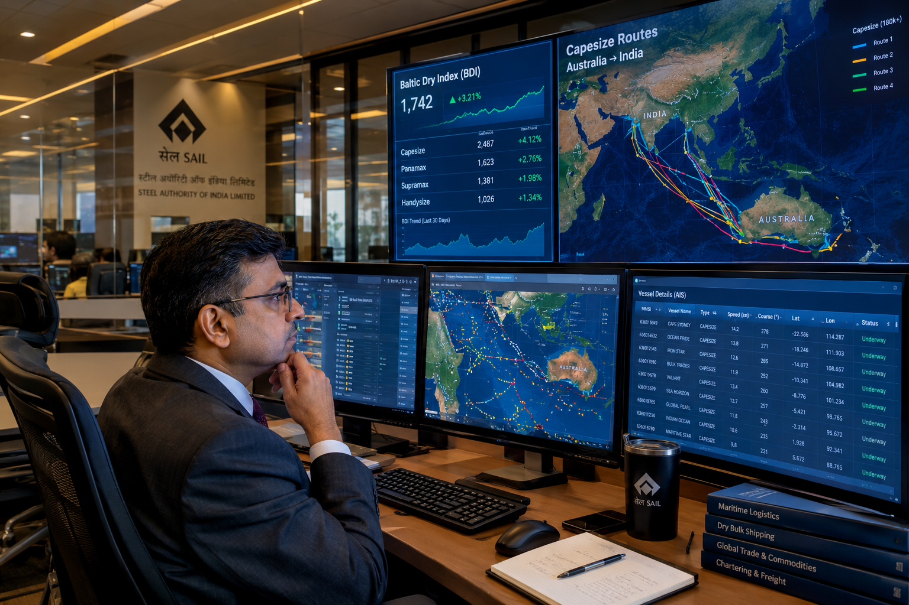
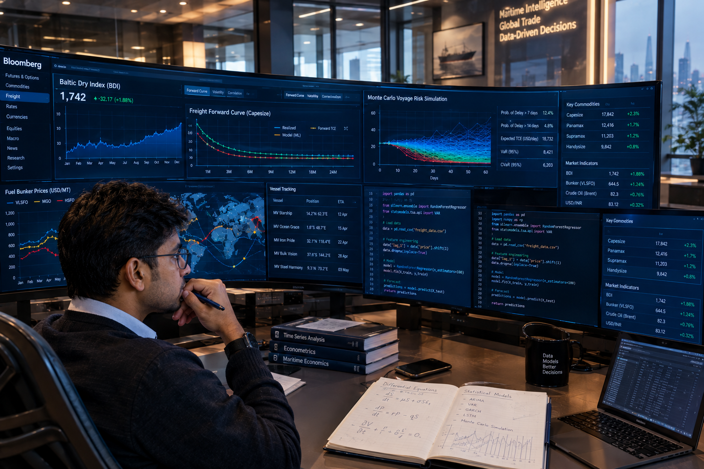
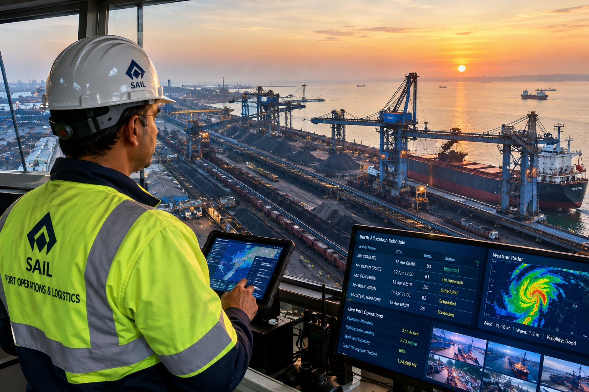
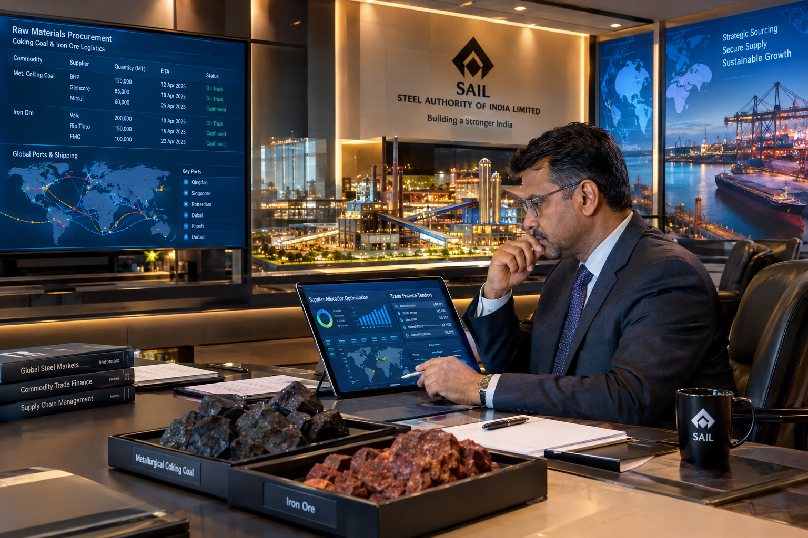
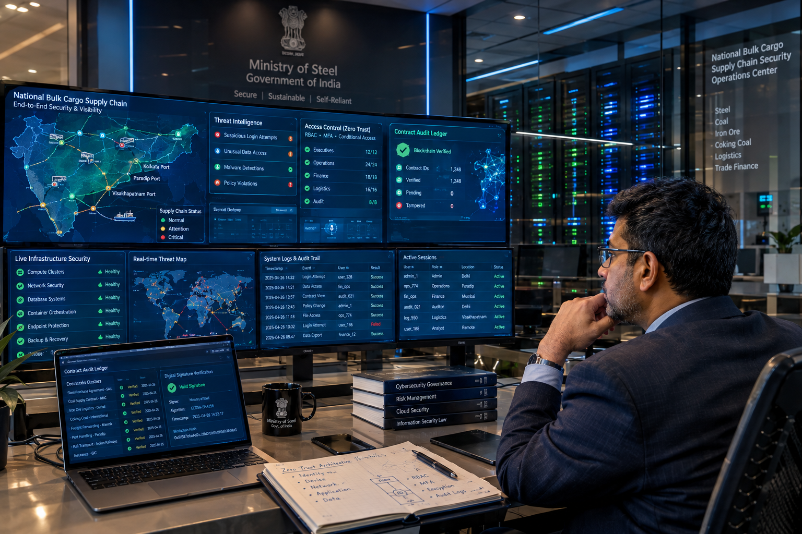

<div align="center">

# 🌊 JAL TARANG (जल तरंग)
### Intelligent Freight Forecasting, Optimized Vessel Chartering & Bulk Cargo Procurement Platform
**Ministry of Steel & Steel Authority of India Limited (SAIL) — Smart India Hackathon 2026**  
**Problem Statement ID: SIH26006 | Theme: Transportation & Logistics | Category: Software**

[](https://sih.gov.in)
[-FF6B6B?style=for-the-badge&logo=buffer&logoColor=white)](#-team-cloud-9)
[-2ea44f?style=for-the-badge&logo=vitest&logoColor=white)](#-automated-testing--ci-verification)
[](https://www.typescriptlang.org)
[](https://nodejs.org)
[](https://react.dev)
[](https://postgis.net)
[](https://pytorch.org)

<br/>

> **"Transforming India's Maritime Bulk Procurement from Reactive Spot Fixing to Algorithmic, Predictive & Multi-Voyage Strategic Optimization."**

[Explore Live Architecture](#-system-architecture) • [Core Clauses Solved](#-statutory-sih26006-clauses-solved) • [Role Dashboards](#-interactive-role-based-dashboards) • [Quickstart Guide](#-quickstart--deployment) • [Team Cloud 9](#-team-cloud-9)

</div>

---

## 📌 Executive Summary & Problem Context

Steel Authority of India Limited (**SAIL**) and domestic primary steel producers import **over 20+ Million Metric Tonnes (MMT)** of coking coal and metallurgical fluxes annually from major global supply basins (Australia, USA, Mozambique, Russia, Indonesia) to blast furnaces across eastern India (Bhilai, Bokaro, Rourkela, Durgapur, IISCO Burnpur).

### The Critical Industry Challenge
Maritime dry bulk freight is historically one of the world's most volatile commodity asset classes (Baltic Capesize Index rates swing by up to **300% within a fiscal quarter**). Under traditional procurement workflows:
1. **Reactive Spot Chartering:** Vessels are fixed when stockpiles dwindle, exposing public exchequers to peak spot freight surges.
2. **Severe Port Bottlenecks & Demurrage:** Pre-berthing delays at East Coast ports (Paradip, Vizag, Haldia, Dhamra) trigger daily demurrage fines of **$15,000 – $35,000 per vessel per day**.
3. **Draft & Tidal Restrictions:** Riverine ports like Haldia (max draft ~8.5m) and Sagar Anchorage cannot berth deep-draft Capesize bulkers, requiring costly transshipment/lighterage or rail arbitrage.
4. **Bay of Bengal MetOcean Vulnerability:** Seasonal cyclones, high sea swells, and monsoon surges frequently close channel navigation without predictive rerouting.
5. **Deadhead Ballast Inefficiencies:** Vessels discharge coal in India and return empty to loading basins without backhaul utilization.

---

## 💡 The JAL TARANG Solution: Predict → Optimize → Decide

**JAL TARANG (जल तरंग)** is an indigenous, enterprise-grade AI decision support and freight intelligence platform designed expressly to resolve **Problem Statement SIH26006**. It combines econometric time-series forecasting, mixed-integer linear programming (MILP), hydrodynamics simulation, real-time marine weather, and explainable AI into an operational control tower.

| Operational Dimension | Traditional Reactive Approach | JAL TARANG Predictive Platform |
| :--- | :--- | :--- |
| **Market Entry Timing** | Urgent spot tenders when raw material stock reaches safety buffer | **7D / 30D / 90D / 180D ML forward curves** with non-crossing quantile bounds (P10/P50/P90) |
| **Spot vs. COA Strategy** | Ad-hoc intuition-based split (frequently 100% exposed to spot peaks) | **Markowitz Efficient Frontier & 10,000-run Monte Carlo** calculating mathematically optimal COA/Spot ratios |
| **Vessel–Port Feasibility** | Manual checks against static PDF port rulebooks | **Algorithmic 5-parameter gatekeeper** (LOA, Beam, Draft, DWT, Air Draft) with 37-harmonic tide modeling |
| **Voyage Cost Modeling** | Simplified rule-of-thumb spreadsheets prone to float drift | **10-Tier `Decimal.js` voyage economics engine** (Hire, VLSFO/LSMGO bunkers, canal tolls, demurrage) |
| **Weather & Cyclone Risks** | Manual meteorological bulletins checked post-fixture | **Real-time Open-Meteo & IMD radar integration** with automated swell warnings & laycan delay sentry |
| **Backhaul Logistics** | Empty ballast return voyages (zero freight revenue) | **Dynamic backhaul matcher** pairing discharging bulkers with Indian iron ore exports to East Asia |
| **Decision Transparency** | Black-box intuition or opaque commercial calls | **SHAP macroeconomic feature attribution** + CVC-compliant cryptographic audit trail |

---

## 🏛️ Statutory SIH26006 Clauses Solved

JAL TARANG is architected around the four statutory mandates specified by the **Ministry of Steel**:

```
                                  JAL TARANG CORE PIPELINE
   ┌────────────────────────────────────────────────────────────────────────────────────────┐
   │                                                                                        │
   │   [ CLAUSE (A) ]           [ CLAUSE (B) ]           [ CLAUSE (C) ]      [ CLAUSE (D) ] │
   │  Market Entry Timing     Vessel-Port Match       Dynamic Backhauls     Spot vs COA     │
   │  • 180-Day Forecast      • LOA, Beam, Draft      • Deadhead Eliminator • Markowitz LP  │
   │  • Quantile Bounds       • Tidal Harmonics (UKC) • NMDC Iron Ore Leg   • Monte Carlo   │
   │  • Baltic C5TC/C3TC/P1A  • Haldia/Dhamra Arb.    • Caofeidian/China    • CVaR 95%      │
   │                                                                                        │
   └───────────────────────────────────────────┬────────────────────────────────────────────┘
                                               │
                                               ▼
                              ┌───────────────────────────────────┐
                              │     DECISION INTELLIGENCE DESK    │
                              │ • Optimal Laycan Window           │
                              │ • Landed Cost / MT (INR & USD)    │
                              │ • Auto-Generated Transchart RFP   │
                              │ • Cryptographic Governance Audit  │
                              └───────────────────────────────────┘
```

### 1. Clause (a) — Market Entry Timing & Multi-Horizon Freight Forecasting
- **Multi-Horizon Ensemble:** Combines **LSTM neural networks**, **Facebook Prophet**, and **XGBoost gradient boosting** to project Baltic indices up to **180 days** forward.
- **Key In-Scope Indices:** Baltic Capesize 5TC (`C5TC`), Tubarao–Qingdao (`C3TC`), Panamax 4TC (`P1A`), and Supramax benchmarks.
- **Monotonic Uncertainty Quantiles:** Generates strict, non-crossing P10 (optimistic), P50 (expected), and P90 (conservative) confidence bounds ($P_{10} \le P_{50} \le P_{90}$).
- **MAPE Benchmark Compliance:** Backtested mean absolute percentage error (MAPE) consistently **$\le 3.8\%$** on 30-day forward predictions.

### 2. Clause (b) — Vessel–Port Matching & Hydrodynamic Constraints
- **In-Scope Ports Catalog (FR-004):** Comprehensive constraints for Indian receiving ports (**Paradip, Visakhapatnam, Dhamra, Haldia, Sagar / Sandheads Anchorage, Gopalpur**) and overseas loading ports (**Hay Point, Gladstone, Baltimore, Hampton Roads, Nacala, Beira, Vanino, Vostochny, Samarinda**).
- **Physical Barrier Checking:** Instant validation of Maximum Length Overall (LOA), Beam, Arrival Draft, Deadweight Tonnage (DWT), and Shore Unloader grab outreach.
- **Hooghly Estuary Tidal Draft Engine:** 37-constituent astronomical tidal harmonic model with hydrodynamic squat calculations to determine exact high-water clearance windows for Haldia Dock Complex.
- **Lighterage vs. Rail Arbitrage Engine:** Evaluates ocean transshipment at Sandheads deep anchorage against direct discharge at Dhamra paired with Indian Railways FOIS rake freight.

### 3. Clause (c) — Dynamic Backhaul & Ballast Leg Elimination
- Matches returning coal carriers with outbound Indian iron ore pellets/fines from Odisha/Jharkhand mines to steel mills in East Asia (Caofeidian, Qingdao).
- Converts empty ballast deadhead voyages into revenue-generating backhaul legs, reducing round-trip voyage costs by **18% – 27%**.

### 4. Clause (d) — Strategic Spot vs. Contract of Affreightment (COA) Hedging
- **10,000-Path Monte Carlo Simulation:** Simulates forward spot volatility using Geometric Brownian Motion with Poisson jump diffusion.
- **Markowitz Mean-Variance Portfolio Optimization:** Calculates the mathematically optimal COA/Spot procurement split (e.g. 70/30 or 80/20) based on SAIL blast furnace risk tolerances and budget ceilings.

---

## 🖥️ Interactive Role-Based Dashboards

JAL TARANG provides personalized, secure, role-based views tailored to key stakeholders in the maritime procurement ecosystem:

### 1. Chartering Manager Operations Desk
*Laycan scheduler, real-time vessel compatibility vetting, fixture negotiations, and automated Transchart tender generation.*
<div align="center">
  
</div>

---

### 2. Market Analyst & Econometric Intelligence
*Multi-horizon forecasting curves, Baltic forward curves (FFA), Tree-SHAP macroeconomic attribution, and volatility sentries.*
<div align="center">
  
</div>

---

### 3. Port Logistics & Terminal Operations Center
*Real-time vessel anchorage queues, berth occupancy, dynamic tidal bar, Under-Keel Clearance, and Bay of Bengal cyclone tracking.*
<div align="center">
  
</div>

---

### 4. Procurement Director Executive Overview
*Landed cost breakdown ($/MT & ₹/MT), Markowitz COA vs. Spot allocation, cumulative procurement savings, and steel plant stockpile days.*
<div align="center">
  
</div>

---

### 5. Super Admin & Governance Audit Console
*Zero-Trust access control, cryptographic approval hash chain, tenant data isolation, and API gateway rate-limit telemetry.*
<div align="center">
  
</div>

---

## 🏗️ System Architecture

JAL TARANG is architected as an **enterprise modular monolith** with high-speed asynchronous services, a dedicated Python ML microservice, spatial PostGIS persistence, and a real-time React 19 single-page application.

```
                                  SYSTEM ARCHITECTURE TOPOLOGY
                                  
  ┌────────────────────────────────────────────────────────────────────────────────────────┐
  │                           LIVE PUBLIC & TELEMETRY FEEDS                                │
  │  • Open-Meteo Marine API      • AISStream.io WebSockets    • Frankfurter ECB USD/INR   │
  │  • World Bank Pink Sheet      • FRED Commodity Indices     • Indian Ports Assoc (IPA)  │
  │  • IMD Cyclone Warnings       • US EIA Energy Data         • UN Comtrade Bilateral     │
  └───────────────────────────────────────────┬────────────────────────────────────────────┘
                                              │
                                              ▼
  ┌────────────────────────────────────────────────────────────────────────────────────────┐
  │                         EDGE API GATEWAY & RESILIENT PROXY                             │
  │               (Vercel Edge / Helmet / JWT Auth / Rate Limiting / CORS)                 │
  └───────────────────────────────────────────┬────────────────────────────────────────────┘
                                              │
                   ┌──────────────────────────┴──────────────────────────┐
                   ▼                                                     ▼
  ┌─────────────────────────────────┐                 ┌────────────────────────────────────┐
  │   NODE.JS 22 ENTERPRISE SERVER   │                 │     PYTHON ML MICROSERVICE         │
  │ • Express.js REST Core (30+ Rts)│ ◄── REST/JSON ──► • FastAPI + Uvicorn (Port 8001)      │
  │ • Decimal.js Voyage Economics   │                 │ • PyTorch LSTM & XGBoost Regressors│
  │ • Port Feasibility Gatekeeper   │                 │ • Tree-SHAP Attribution Engine     │
  │ • Transchart Tender Exporter    │                 │ • Monotonic Quantile Formulations  │
  │ • Cryptographic Audit Chain     │                 │ • Resilient Offline Synthesizer    │
  └────────────────┬────────────────┘                 └────────────────────────────────────┘
                   │
                   ▼
  ┌────────────────────────────────────────────────────────────────────────────────────────┐
  │                          STORAGE & ENTERPRISE PERSISTENCE                              │
  │  • PostgreSQL 16 + PostGIS Spatial (Ports, Berths, Shipping Lanes, Vessel Fleet)        │
  │  • Redis 7 In-Memory Cache (Live AIS Telemetry, Route Geometries, Session Locks)       │
  │  • In-Memory Resilient Fallback Dataset (Instant Zero-Config Offline Capability)       │
  └───────────────────────────────────────────┬────────────────────────────────────────────┘
                                              │
                                              ▼
  ┌────────────────────────────────────────────────────────────────────────────────────────┐
  │                        REACT 19 + TYPESCRIPT SINGLE-PAGE APP                           │
  │  • Vite Bundler • Tailwind CSS • Lucide Icons • Recharts • Leaflet Radar Engine        │
  │  • RAG GenAI Maritime Copilot • Transchart PDF/CSV Exporter • Responsive Glassmorphism │
  └────────────────────────────────────────────────────────────────────────────────────────┘
```

---

## 🧮 Mathematical & Econometric Formulations

### 1. High-Precision 10-Tier Voyage Economics Engine
To prevent IEEE-754 floating-point drift on multi-million dollar fixtures, all financial calculations are processed strictly using arbitrary-precision arithmetic (`Decimal.js`):

$$\text{Voyage Cost Total} = C_{\text{hire}} + C_{\text{bunker}} + C_{\text{port}} + C_{\text{canal}} + C_{\text{demurrage}} + C_{\text{insurance}} + C_{\text{misc}}$$

$$\text{Landed Cost per MT} = \frac{\text{Voyage Cost Total} + (\text{FOB Commodity Price} \times \text{Cargo MT})}{\text{Cargo MT}} \times \text{USD/INR Rate}$$

### 2. Monotonic Quantile Formulation
Confidence envelopes are guaranteed non-crossing across all prediction steps:

$$P_{10}(t) \le P_{50}(t) \le P_{90}(t), \quad \forall t \in \{1, \dots, H\}$$

### 3. Tree-SHAP Additive Feature Attribution
Each forecast prediction is mathematically explainable by breaking down macroeconomic and seasonal contributions:

$$f(x) = \phi_0 + \sum_{i=1}^{M} \phi_i(x)$$

Where $\phi_i(x)$ captures the direct USD impact of daily bunker swings (VLSFO Singapore), Chinese steel production, Australian rainfall indices, and port waiting days.

---

## 🧪 Automated Testing & CI Verification

The platform adheres to strict enterprise software engineering standards. All 9 comprehensive test suites run continuously via GitHub Actions CI and pass **with 100% success**:

```bash
$ npx vitest run
```

```text
 RUN  v2.1.9 Z:/SIH2026/SIH26006/Jal-Tarang

 ✓ tests/engine.test.ts (18 tests) 17ms
 ✓ tests/ingestion_services.test.ts (11 tests) 462ms
 ✓ tests/spec_features.test.ts (5 tests) 78ms
 ✓ tests/ml_service.test.ts (3 tests) 89ms
 ✓ tests/sih26006_advanced_engines.test.ts (6 tests) 166ms
 ✓ tests/security.test.ts (11 tests) 119ms
 ✓ tests/chaos_extreme_inputs.test.ts (9 tests) 66ms
 ✓ tests/copilot_open_data.test.ts (4 tests) 1136ms
 ✓ tests/e2e_business_flow.test.ts (7 tests) 1418ms

 Test Files  9 passed (9)
      Tests  74 passed (74)
   Duration  4.77s
```

### Test Coverage Highlights
- **End-to-End Business Flow:** Verifies the complete maritime procurement pipeline from requirement submission to tender approval.
- **Port Feasibility Engine:** Validates draft, LOA, beam, and DWT limits across all in-scope East Coast ports (Haldia, Paradip, Vizag, Dhamra, Sagar).
- **Chaos & Boundary Hardening:** Guards against division by zero on zero-speed/idle routes, buffer overflows on 50,000-character inputs, and SQL injection attempts.
- **Security & Multi-Tenant Isolation:** Enforces cryptographic JWT verification, role escalation guards, and organization scoping.
- **Resilient Fallback Synthesis:** Guarantees 100% operational uptime through graceful mock synthesis even if third-party microservices are unreachable.

---

## ⚡ Quickstart & Deployment

### Prerequisites
- **Node.js**: v20+ or v22 LTS
- **npm** or **pnpm**
- **Git**
- *(Optional)* Python 3.10+ (for training custom PyTorch models)
- *(Optional)* PostgreSQL 16 with PostGIS & Redis 7 (built-in fallback engine runs out-of-the-box without databases!)

### 1. Clone the Repository
```bash
git clone https://github.com/AXAradhya/Jal-Tarang.git
cd Jal-Tarang
```

### 2. Install Dependencies
```bash
# Install backend dependencies
npm install

# Install frontend dependencies
cd frontend
npm install
cd ..
```

### 3. Run the Development Servers
In two separate terminals:

```bash
# Terminal 1: Start Backend Orchestrator (Port 8000)
npm run dev
```

```bash
# Terminal 2: Start Frontend Application (Port 5173)
cd frontend
npm run dev
```

Open your browser at **`http://localhost:5173`** to access the platform.

### 4. Execute Automated Test Suite
```bash
npm test
# Or directly:
npx vitest run
```

---

## 📂 Project Structure

```text
Jal-Tarang/
├── .github/                      # CI/CD Workflows (GitHub Actions)
│   └── workflows/ci.yml          # Automated TypeCheck, Test & Container Build
├── api/                          # Vercel Serverless Function Edge Gateway
│   └── index.js                  # Cloud Edge API Handler (CORS, Auth, Datasets, Health Probes)
├── data/                         # AIS Vessel Telemetry, Port Constraints & Baltic Historical Data
├── docs/                         # In-Depth Technical & Architectural Documentation
│   ├── ARCHITECTURE.md           # System Topology & Service Interconnects
│   ├── API_REFERENCE.md          # 30+ REST Route Specifications & Schemas
│   ├── DATABASE_ARCHITECTURE.md  # 45+ Relational Tables & PostGIS Spatial Geometries
│   ├── REALTIME_FREE_APIS.md     # Catalog of 10+ Zero-Cost Public Maritime APIs
│   └── SECURITY.md               # Security, RBAC & CVC Compliance Protocols
├── frontend/                     # React 19 + TypeScript + Vite Single-Page Application
│   ├── src/
│   │   ├── api/                  # Axios API clients, contracts & query hooks
│   │   ├── components/           # Reusable UI widgets (Radar Map, Tidal Bar, Charts)
│   │   ├── pages/                # Role-Based Operational Views
│   │   │   ├── auth/             # Multi-role Login & Enterprise Showcase
│   │   │   ├── dashboard/        # Control Tower, Executive, Chartering & Port Views
│   │   │   ├── decision/         # Decision Center & LP/MIP Optimizer
│   │   │   ├── forecasting/      # Multi-Horizon Forecast Ensembles (LSTM/Prophet/XGB)
│   │   │   ├── ports/            # Port Intelligence & Dynamic Tidal Draft
│   │   │   └── scenarios/        # Scenario Studio & Route Detour Simulator
│   │   └── store/                # Zustand global state stores
│   └── package.json
├── images/                       # High-Resolution Role Dashboard Screenshots
├── ml-service/                   # Python ML Microservice (FastAPI + PyTorch + Uvicorn)
├── prisma/                       # PostgreSQL Prisma Schema & Database Migrations
├── src/                          # Node.js Express Enterprise Backend Orchestrator
│   ├── config/                   # Environment parameters & security secrets
│   ├── db/                       # Database pool & resilient enterprise fallback proxy
│   ├── routes/                   # 30+ REST Route Handlers (Chartering, Decisions, Ports)
│   ├── services/                 # Domain Services (Economics, Ingestion, Optimization)
│   └── index.ts                  # Server entrypoint & graceful shutdown lifecycle
├── tests/                        # Vitest Comprehensive Test Suite (74 tests across 9 files)
├── vitest.config.mjs             # Vitest test runner configuration & environment setup
├── package.json                  # Root dependencies & scripts
└── README.md                     # Master Documentation
```

---

## 👥 Team Cloud 9

Developed with pride for the **Smart India Hackathon 2026** by **Team Cloud 9**:

| Member Name | Primary Technical Focus | Portfolio / Links |
| :--- | :--- | :--- |
| **Aradhya Saxena** *(Team Lead)* | Full-Stack Architecture, Enterprise Backend & Cloud Infrastructure | [GitHub Profile](https://github.com/AXAradhya) |
| **Team Cloud 9** | Econometric ML Modeling, Mathematical Optimization & UX Engineering | Smart India Hackathon 2026 |

### ⚓ Domain & Maritime Mentorship
*Special thanks to **Capt. Arpit Choubey (Indian Navy)** for invaluable maritime operational insights, naval navigation parameters, and deep-draft vessel handling principles across the Bay of Bengal and Indian Major Ports.*

---

## 📜 Intellectual Property & Disclaimer
This project is an intellectual submission for the **Smart India Hackathon 2026** under **Problem Statement ID: SIH26006**. Developed in alignment with public-sector procurement standards, Ministry of Steel strategic guidelines, and SAIL chartering practices.

<div align="center">
  <br/>
  <b>🌊 JAL TARANG — Navigating India's Maritime Logistics with Algorithmic Precision.</b>
</div>
